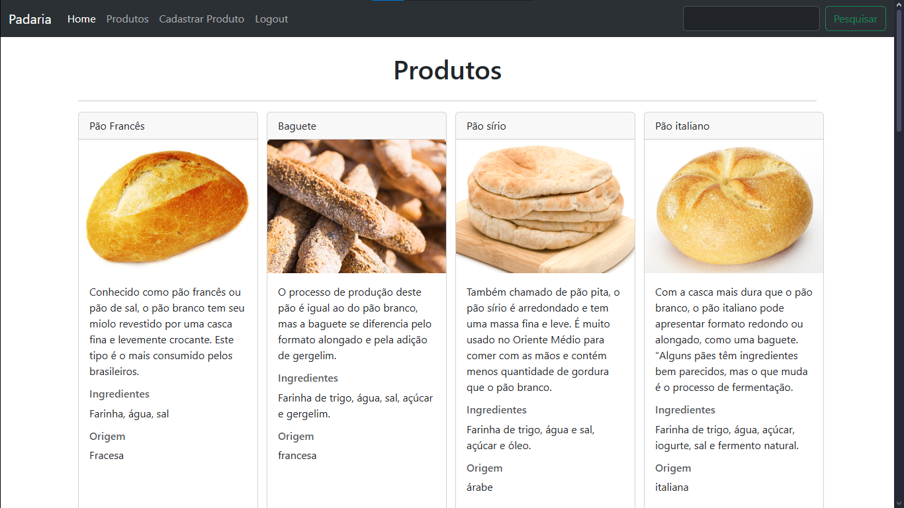

# Site da Padaria - Projeto Flask

### Sobre o Projeto
Este projeto é um site básico para uma padaria, desenvolvido em Flask, meu primeiro framework de backend. O objetivo foi criar uma aplicação web completa, com rotas, templates e integração com banco de dados, aplicando os conceitos de desenvolvimento backend de forma prática.

### Tecnologias Utilizadas
- **Backend:**
    - **Python**
    - **Flask**
    - **SQLAlchemy**
- **Frontend:**
    - **HTML5**
    - **CSS3**
    - **JavaScript**
    - **Bootstrap**
- **Banco de Dados:**
    - **SQLite**

### Funcionalidades
- **Gerenciamento de Produtos (CRUD):** É possível **cadastrar**, **editar** e **deletar** produtos do menu da padaria.
- **Busca de Produtos:** Funcionalidade de pesquisa para encontrar produtos específicos pelo nome.
- **Integração com Banco de Dados:** Gerenciamento dos dados de forma persistente utilizando SQLAlchemy e SQLite.
- **Design Responsivo:** O layout é adaptável a diferentes tamanhos de tela graças ao uso do Bootstrap.

---

### Capturas de Tela do Projeto

  
   
  <em>Página inicial do site.</em>

 

  
   

 

  
   
  <em>Página para exibição dos produtos disponíveis.</em>

 

  
   
  <em>Interface para cadastrar novos produtos no banco de dados.</em>

---

### Estrutura de Rotas
- `/`: Rota principal que exibe a página inicial.
- `/produtos`: Rota para visualizar todos os produtos e realizar pesquisas.
- `/cadastrar_produto`: Rota para o formulário de cadastro de novos produtos.
- `/editar_produtos/<id>`: Rota para editar um produto específico, identificado pelo seu ID.
- `/deletar_produto/<id>`: Rota para remover um produto do banco de dados.

